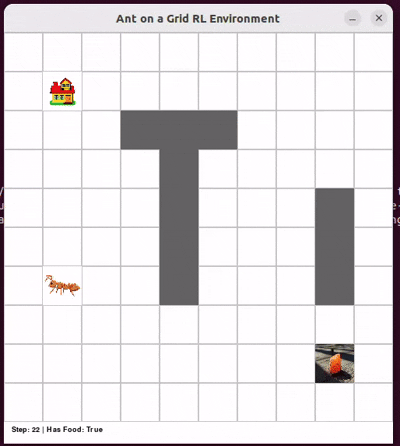

# Ant Grid RL Assignment

This repository contains code and resources for training, evaluating, and visualizing reinforcement learning agents (A2C, DQN, PPO) on a custom Ant Grid environment.

## Demo




## Directory Structure

- `env/`  
  Contains the custom environment ([env/ant_grid_env.py](env/ant_grid_env.py)), visualization tools, and cache files.
- `models/`  
  Stores trained models and checkpoints.
- `archives/`  
  Backup of model files.
- `media/`  
  Images and videos for documentation and visualization.
- `papers/`  
  Related research papers.

## Main Scripts

- [`train_a2c_agent.py`](train_a2c_agent.py): Train an A2C agent.
- [`train_dqn_agent.py`](train_dqn_agent.py): Train a DQN agent.
- [`train_ppo_agent.py`](train_ppo_agent.py): Train a PPO agent.
- [`a2c_bh.py`](a2c_bh.py): Benchmark and evaluate A2C agent.
- [`dqn_bh.py`](dqn_bh.py): Benchmark and evaluate DQN agent.
- [`ppo_bh.py`](ppo_bh.py): Benchmark and evaluate PPO agent.
- [`eval.py`](eval.py): General evaluation utilities.

## Environment

The custom Ant Grid environment is implemented in [`env/ant_grid_env.py`](env/ant_grid_env.py).  

Visulization is availabe. Run the environment script to visualize.

## Training & Evaluation

Each training script initializes the environment, sets reproducibility seeds, logs metrics to WandB, and saves models to the `models/` directory.  
Benchmark scripts compare trained agents to random baselines and log results.

## Requirements

- Python 3.8+
- [Stable Baselines3](https://github.com/DLR-RM/stable-baselines3)
- [Gymnasium](https://github.com/Farama-Foundation/Gymnasium)
- [WandB](https://wandb.ai/)
- [Pygame](https://www.pygame.org/)

Install dependencies:
```sh
pip install -r requirements.txt